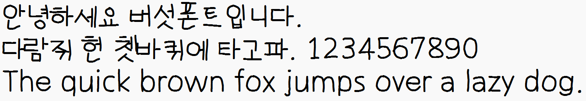

# MushroomFont
## 미리 보기


## 만든 의도
- 그냥 겁내 열받으라고 만들었습니다.

## 사용법
### 로컬에 설치
- Releases에서 폰트를 다운로드받습니다.
- 폰트 (TTF 파일) 를 설치합니다.
- MushroomFont 또는 버섯폰트를 찾아 사용합니다.

### 웹폰트
- CSS
```css
* {
    font-family: "MushroomFont";
    src: url("https://github.com/yj0524/MushroomFont/releases/latest/download/MushroomFont-Regular.woff") format("woff"),
        url("https://github.com/yj0524/MushroomFont/releases/latest/download/MushroomFont-Regular.woff2") format("woff2");
    font-weight: normal;
    font-style: normal;
}
```

## License
- 상업적 용도로 이용 가능합니다.
- 폰트를 수정하여 사용하셔도 됩니다.
- 폰트를 유료로 재판매하거나, 자신의 것처럼 하거나, 무단 재배포하면 안 됩니다.
- 폰트의 이미지를 훼손하는 행위 외 모든 곳에 활용 가능합니다.

## 폰트 오류 제보 또는 폰트 수정 요청
- GitHub Issues : [Issues - yj0524/MushroomFont](https://github.com/yj0524/MushroomFont/issues)
- Discord : [yj0524_kr](https://discord.com/users/740016886204334141)
- E-Mail : [admin@mushtle.co.kr](mailto://admin@mushtle.co.kr)
